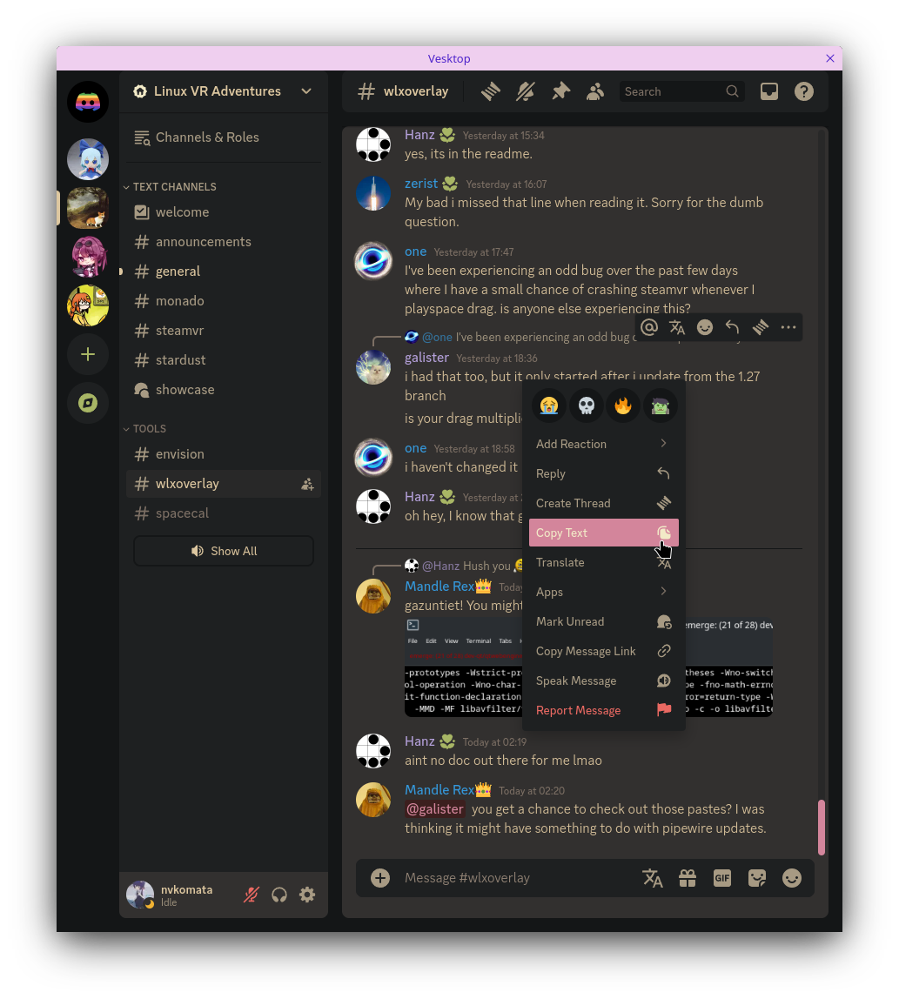

# vegetable-oil
a modern discord theme based on [vencord-theme](https://github.com/Synqat/vencord-theme), with fixes and improvements



### how to install?

1. vencord way
    - open user settings
    - go to "online themes" in the "themes" tab under "vencord"
    - paste this link into the text box, one link per line
      ```
      https://raw.githubusercontent.com/nvkomata/vegetable-oil/main/vegetable-oil.theme.css
      ```

2. other ways
    - you're on your own, i don't care

### why the name?
it's what i cook human meat on, and like, come on, doesn't the theme just remind you of **oil**? :troll: (currently covering myself in it)

### found a bug? have a suggestion?
make an issue on this repo